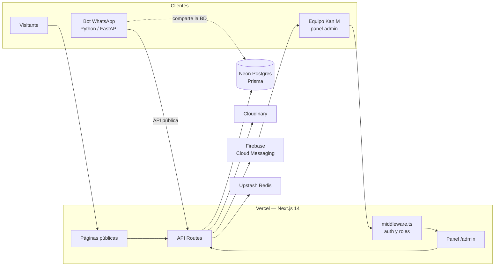

<div align="center">


# Kan M — Repostería y Catering

Sitio web público y panel de administración para una repostería y servicio de catering real en la Zona Colonial de Santo Domingo.

**[kanmreposteriaycatering.com](https://www.kanmreposteriaycatering.com)**


</div>

---

## Tabla de contenido

- [Sobre el proyecto](#sobre-el-proyecto)
- [Funcionalidades](#funcionalidades)
- [Stack técnico](#stack-técnico)
- [Arquitectura](#arquitectura)
- [Decisiones de arquitectura](#decisiones-de-arquitectura)
- [Estructura del proyecto](#estructura-del-proyecto)
- [Roles y permisos](#roles-y-permisos)
- [Seguridad](#seguridad)
- [Pruebas](#pruebas)
- [Inicio rápido](#inicio-rápido)
- [Scripts disponibles](#scripts-disponibles)
- [Estado del proyecto](#estado-del-proyecto)
- [Trabajar con asistentes de IA](#trabajar-con-asistentes-de-ia)
- [Autor y licencia](#autor-y-licencia)

---

## Sobre el proyecto

Kan M llevaba sus pedidos por WhatsApp y hojas sueltas: las cotizaciones se perdían entre conversaciones, no había una fecha fiable de entrega y nadie sabía cuánto se había vendido en el mes. Este proyecto sustituye ese flujo con dos piezas que comparten una sola base de datos:

1. **Sitio público** — catálogo con carrito y comprobante de pago, cotizaciones de eventos, páginas de marca y FAQ, en español e inglés.
2. **Panel de administración** — el equipo gestiona pedidos, un calendario de entregas, el catálogo, reportes y usuarios, con permisos distintos según el rol.

Un **bot de WhatsApp** que vive en otro repositorio (Python/FastAPI) comparte esa base de datos y lee la información del negocio desde la API pública de este proyecto, de modo que el bot y la web nunca se contradicen.

## Funcionalidades

### Sitio público

| Sección | Descripción |
|---|---|
| **Inicio** | Hero con carrusel, productos destacados rotativos y testimonios. |
| **Catálogo** (`/catalogo`) | Filtro por categoría, carrito y checkout con comprobante de pago. Cada pedido genera un código `PED-XXXX` para consultar su estado. |
| **Cotizar** (`/cotizar`) | Formulario de cotización de eventos con fotos de referencia. Exige un mínimo de 3 días de anticipación. |
| **Catering** (`/catering`) | Página del servicio de catering para eventos sociales y corporativos. |
| **La Latica** (`/la-latica`) | Landing del producto estrella (postres en lata) con galería. |
| **Empanadoteca** (`/empanadoteca`) | Sub-marca con identidad visual propia y transición animada de marca. |
| **Nosotros** (`/nosotros`) | Historia del negocio, contacto, mapa y horario. |
| **FAQ** (`/faq`) | Preguntas frecuentes generadas desde una fuente única de datos del negocio. |

Además, en todo el sitio:

- Cambio de idioma **español / inglés** instantáneo, sin recargar la página.
- **SEO**: metadata por página, Open Graph, datos estructurados `LocalBusiness` (JSON-LD), `sitemap.xml` y `robots.txt`.
- Botón flotante de **WhatsApp** y enlaces de delivery (Uber Eats).
- **Interruptores remotos**: el dueño puede apagar el catálogo o las cotizaciones desde el panel, sin desplegar. Mientras estén apagados, la sección muestra una pantalla de "Próximamente".

### Panel de administración

| Módulo | Descripción |
|---|---|
| **Dashboard** | Pedidos de cotización y órdenes del carrito en pestañas, con cambio de estado, asignación a una repostera, precio acordado, depósito y notas internas. |
| **Calendario** | Vistas de mes, semana y día, con mapa de calor de carga, filtros por estado y panel lateral de detalle. |
| **Catálogo** | CRUD de productos con subida de imágenes a Cloudinary y estados de disponibilidad (disponible, agotado u oculto). |
| **Reportes** | Métricas del mes, tendencia diaria, comparación con el mes anterior y exportación a CSV. Solo para roles con acceso a ventas. |
| **Usuarios** | Alta, edición, desactivación y roles. Protege al último OWNER activo: nadie puede degradarlo, desactivarlo ni eliminarlo, y ningún OWNER puede quitarse su propio rol. |
| **Configuración** | Interruptores del sitio público y actividad reciente del panel. |
| **Notificaciones push** | Aviso en el celular (Firebase Cloud Messaging) por cada pedido nuevo u orden del carrito. Ver [Estado del proyecto](#estado-del-proyecto). |

### Integraciones

- **Bot de WhatsApp (externo)**: consume `/api/public/business-info` y `/api/public/faq`, endpoints públicos de solo lectura con caché de 5 minutos, y comparte la base de datos.
- **API externa de órdenes (opcional)**: sincroniza las órdenes confirmadas del carrito con un sistema externo, con timeout de 5 s y estado `NOT_SENT`, `SENT` o `FAILED`.
- **Clientes móviles**: la API acepta `Authorization: Bearer <jwt>` además de la cookie de sesión, y expone `/api/health` para comprobar disponibilidad y versión.

## Stack técnico

| Capa | Tecnología |
|---|---|
| Framework | [Next.js 14](https://nextjs.org/) (App Router) + React 18 + TypeScript |
| Estilos | Tailwind CSS + variables CSS de marca · `next/font` (Playfair Display, Outfit, Dancing Script) |
| Base de datos | [Neon](https://neon.tech/) (Postgres serverless) + [Prisma 5](https://www.prisma.io/) |
| Autenticación | JWT (`jose`) en cookie httpOnly + `bcryptjs` |
| Validación | `zod` |
| Imágenes | Cloudinary (subida firmada desde el servidor) |
| Rate limiting | Upstash Redis |
| Notificaciones | Firebase Cloud Messaging (`firebase-admin` + service worker web) |
| Pruebas | [Vitest](https://vitest.dev/) |
| Íconos | `lucide-react` |
| Hosting y observabilidad | Vercel · Vercel Analytics · Speed Insights |

## Arquitectura



## Decisiones de arquitectura

**Una sola fuente de verdad para los datos del negocio.** Horario, dirección, teléfono, enlaces, precios de referencia y FAQ viven en `src/lib/bizInfo.ts`. La web, los datos estructurados de Google y el bot de WhatsApp leen de ahí, así que un cambio de horario no puede dejar al bot diciendo una cosa y a la web otra. El sitio también se auto-describe: `/api/public/business-info` expone esos datos y calcula si el local está abierto según la zona horaria de República Dominicana.

**La autorización se decide en el servidor, con dos capas distintas.** El middleware protege rutas leyendo el rol del JWT, lo que es rápido pero no consulta la base. Cada endpoint, en cambio, resuelve la sesión con `getSession`, que sí relee al usuario de la base en cada request: si alguien queda desactivado o cambia de rol, las APIs lo reflejan de inmediato. Un bloqueo de página no protege datos por sí solo, así que el rol también decide **qué campos viajan** en la respuesta: los roles sin acceso a ventas no reciben precios, depósitos ni totales, en lugar de recibirlos y que la interfaz los esconda.

**El precio nunca lo pone el cliente.** El carrito viaja desde el navegador, así que al confirmar una orden el servidor solo usa el identificador y la cantidad de cada línea: nombre, categoría y precio se releen del catálogo, y el total se recalcula. Un carrito manipulado no cambia lo que se cobra.

**Las imágenes las valida el servidor.** Ninguna subida va directa desde el navegador: el archivo se valida en el backend, que firma la petición a Cloudinary con credenciales que nunca llegan al cliente. La app solo guarda URLs que pertenezcan a su propia cuenta.

**Degradar en vez de romper.** Varias piezas son opcionales por diseño: sin credenciales de Firebase las notificaciones son un no-op y, sin la API externa, el sync de órdenes queda marcado como `NOT_SENT` en lugar de fallar el pedido. La tabla de configuración se crea sola en el primer uso, para no depender de una migración manual.

**Las tablas del bot no se tocan.** El bot administra sus propias tablas (`wa_*`) en la base compartida. Están declaradas en el schema para que Prisma no las borre, pero las migraciones de este repositorio no las crean ni las modifican.

## Estructura del proyecto

```text
kan-m/
├── docs/assets/              Imágenes usadas en la documentación
├── prisma/
│   ├── schema.prisma         Modelo de datos (fuente de verdad)
│   ├── migrations/           Migraciones aplicables con `prisma migrate deploy`
│   ├── baseline.sql          DDL de referencia del esquema
│   └── seed.ts               Productos de ejemplo para desarrollo
├── public/                   Logos, íconos, fotos y service worker de FCM
├── scripts/                  seed-owner.ts (primer OWNER) y SQL de apoyo
├── tests/                    Suite de Vitest
└── src/
    ├── app/
    │   ├── page.tsx          Inicio
    │   ├── catalogo/         Catálogo + carrito
    │   ├── cotizar/          Formulario de cotización
    │   ├── catering/  la-latica/  empanadoteca/  nosotros/  faq/
    │   ├── admin/
    │   │   ├── dashboard/    Pedidos + órdenes del carrito
    │   │   ├── calendario/   Vistas mes / semana / día
    │   │   ├── reportes/     Métricas y export CSV
    │   │   ├── usuarios/     (OWNER) gestión de usuarios
    │   │   └── configuracion/(OWNER) interruptores del sitio
    │   ├── api/
    │   │   ├── auth/         login · logout · me
    │   │   ├── orders/       Cotizaciones (CRUD + upload público)
    │   │   ├── cart-orders/  Órdenes del carrito, comprobante y estado por código
    │   │   ├── products/     Catálogo
    │   │   ├── users/        Usuarios y registro de token FCM
    │   │   ├── admin/        Reportes, settings y endpoints del panel
    │   │   ├── public/       Info del negocio y FAQ (para el bot)
    │   │   └── health/  activity/  bakers/  upload/
    │   ├── sitemap.ts · robots.ts · layout.tsx
    ├── components/           Componentes de UI compartidos
    ├── lib/
    │   ├── auth.ts           Sesiones JWT, bcrypt y helpers de autorización
    │   ├── financials.ts     Recorte de campos de ventas según el rol
    │   ├── bizInfo.ts        Fuente única de datos del negocio
    │   ├── i18n/             Diccionario y proveedor ES/EN
    │   ├── rateLimit.ts      Rate limiting por IP
    │   ├── push.ts           Envío de notificaciones FCM
    │   └── ...               db, cloudinary, settings, activityLog, etc.
    └── middleware.ts         Protección de /admin y APIs sensibles por rol
```

El login del panel no vive en una ruta adivinable: su segmento se define con una variable de entorno y se documenta en [SETUP.md](./SETUP.md).

## Roles y permisos

| Capacidad | `OWNER` | `BAKER` | `ASSISTANT` |
|---|:---:|:---:|:---:|
| Ver pedidos y calendario | ✅ | ✅ | ✅ |
| Editar cualquier pedido | ✅ | ✅ | — |
| Gestionar órdenes del carrito | ✅ | ✅ | — |
| Editar catálogo y subir fotos | ✅ | ✅ | — |
| Ver montos de ventas y facturación | ✅ | ✅ | — |
| Ver reportes y bitácora | ✅ | ✅ | — |
| Eliminar pedidos | ✅ | — | — |
| Usuarios y configuración del sitio | ✅ | — | — |

`ASSISTANT` es un rol operativo: ve los pedidos que tiene que preparar y entregar, pero no la información económica. Los permisos se declaran como helpers en `src/lib/auth.ts` y se aplican dentro de cada endpoint; el middleware añade una capa previa a nivel de ruta.

## Seguridad

- **Contraseñas**: `bcrypt` con 12 rondas, con bloqueo temporal de la cuenta tras varios intentos fallidos.
- **Sesiones**: JWT firmado (HS256) de 7 días en cookie `httpOnly`, `sameSite=lax` y `secure` en producción. Cada endpoint revalida la sesión contra la base de datos.
- **Acceso al panel**: el login vive en una ruta cuyo segmento es un secreto de servidor y nunca se expone al navegador. `/admin` redirige al inicio si no hay sesión, y `robots.txt` excluye el panel y la ruta de acceso.
- **Autorización por rol** en cada endpoint, incluido el recorte de campos económicos para los roles que no deben verlos.
- **Rate limiting por IP** en login, cotizaciones, órdenes del carrito, subidas y consulta de estado.
- **Cabeceras**: Content-Security-Policy, HSTS con preload, `X-Frame-Options: DENY`, `X-Content-Type-Options`, `Referrer-Policy` y `Permissions-Policy`.
- **Subidas**: validadas y firmadas en el servidor, con límite de tamaño y allowlist de la cuenta propia de Cloudinary.
- **Validación**: la entrada de los endpoints públicos se valida en el servidor con `zod`.
- **Secretos**: nunca en el repositorio; `.env.example` documenta cada variable sin valores.

## Pruebas

```bash
npm test
```

**101 tests en 6 archivos** con Vitest, priorizando casos límite sobre cantidad. Los tests de API ejercitan los handlers reales y simulan solo la infraestructura (base de datos, rate limit, configuración y push), de modo que los permisos que se evalúan son los de producción.

| Archivo | Qué cubre |
|---|---|
| `tests/bizinfo-horario.test.ts` | Apertura y cierre al minuto exacto, días de horario corto y largo, conversión de zona horaria con cambio de día, feriados y horarios especiales |
| `tests/api-orders.test.ts` | El mínimo de 3 días de antelación (día exacto, día anterior, fechas pasadas, tope de dos años, pedidos tomados en persona) y el filtrado de campos por rol |
| `tests/api-cart-orders.test.ts` | Recálculo de precios en el servidor ante carritos manipulados, cantidades repetidas, productos inexistentes o agotados y redondeo |
| `tests/api-admin-cart-orders.test.ts` | Listado y detalle de órdenes según el rol |
| `tests/auth-permissions.test.ts` | Cada rol contra cada helper de autorización |
| `tests/financials.test.ts` | El recorte de campos económicos, campo por campo |

## Inicio rápido

**Requisitos:** Node.js 18.17 o superior y una base de datos Postgres (Neon recomendado).

```bash
# 1. Instalar dependencias (también genera el cliente de Prisma)
npm install

# 2. Configurar variables de entorno
cp .env.example .env.local
#    → completa al menos DATABASE_URL, DATABASE_URL_UNPOOLED, AUTH_SECRET,
#      ADMIN_LOGIN_SLUG y las de Cloudinary

# 3. Crear las tablas
npx prisma migrate deploy

# 4. Crear el primer usuario OWNER
ADMIN_EMAIL=tu@correo.com ADMIN_NAME="Tu Nombre" ADMIN_PASSWORD=unaClaveFuerte \
  npx tsx scripts/seed-owner.ts

# 5. Levantar el servidor de desarrollo
npm run dev
```

El sitio público queda en http://localhost:3000. Para entrar al panel, usa la ruta de acceso que define tu variable `ADMIN_LOGIN_SLUG`, explicada en [SETUP.md](./SETUP.md), donde también está la configuración completa: variables de entorno, Firebase, Upstash, bot, despliegue y mantenimiento.

## Scripts disponibles

| Comando | Qué hace |
|---|---|
| `npm run dev` | Servidor de desarrollo |
| `npm run build` | Genera el cliente Prisma y compila para producción |
| `npm run start` | Sirve el build de producción |
| `npm run lint` | ESLint (config de Next.js) |
| `npm test` | Suite de Vitest |
| `npm run test:watch` | Vitest en modo watch |
| `npm run db:seed` | Carga productos de ejemplo (**borra** los productos existentes) |
| `npm run db:migrate` | `prisma migrate dev` (ver nota sobre migraciones en SETUP.md) |

## Estado del proyecto

El sitio está **en producción** y el negocio lo usa a diario. Estas son las limitaciones conocidas, anotadas con honestidad:

| Limitación | Estado |
|---|---|
| Revisión de seguridad pendiente en algunas áreas. | Detectado en revisión (sep 2026), pendiente de corrección. |
| La migración que completa el esquema aún no se ha marcado como aplicada en la base de producción, que ya tenía las tablas creadas. | Detectado en revisión (sep 2026), pendiente de corrección. |
| Las pruebas cubren reglas de negocio y permisos; no hay pruebas de interfaz ni end-to-end. | Detectado en revisión (sep 2026), pendiente de corrección. |
| Quedan avisos de ESLint sobre dependencias de hooks en el dashboard. | Detectado en revisión (sep 2026), pendiente de corrección. |

## Trabajar con asistentes de IA

<!-- Sección pendiente de escribir por el autor. -->

## Autor y licencia

**Sadiel Rojas Padilla** — diseño y desarrollo full-stack.
GitHub: [@4n1mah](https://github.com/4n1mah)

© 2026 Sadiel Rojas Padilla. **Todos los derechos reservados.** Proyecto desarrollado para Kan M Repostería y Catering, un negocio real: el código se publica para poder leerse y evaluarse como muestra de trabajo, no para reutilizarse. El nombre, el logotipo, los textos y las fotografías del negocio le pertenecen a él. Ver [LICENSE](./LICENSE).
