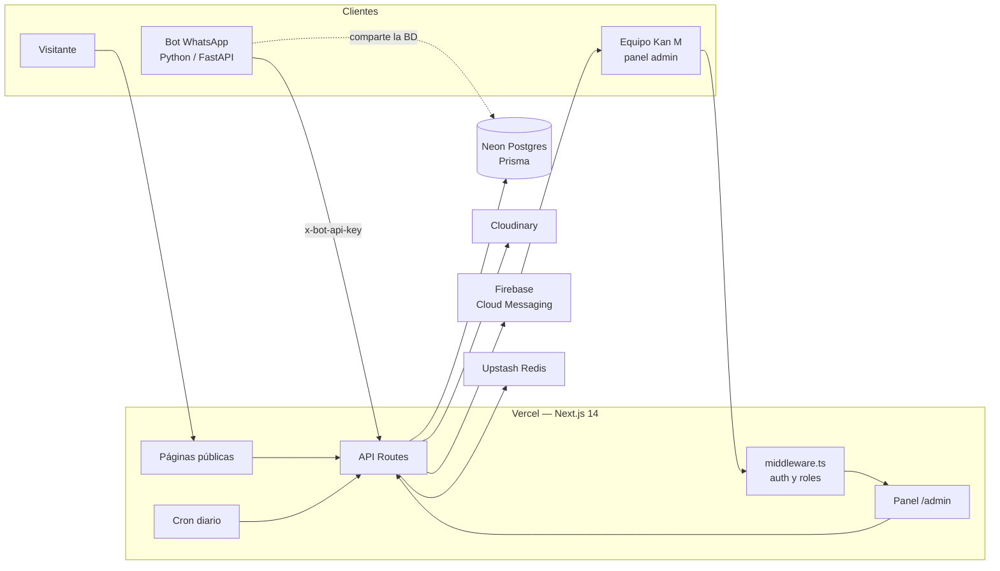

<div align="center">


# Kan M — Repostería y Catering

Sitio web público y panel de administración para una repostería y servicio de catering real en la Zona Colonial de Santo Domingo.

**[kanmreposteriaycatering.com](https://www.kanmreposteriaycatering.com)**


</div>

---

## Tabla de contenido

- [Sobre el proyecto](#sobre-el-proyecto)
- [Funcionalidades](#funcionalidades)
- [Stack técnico](#stack-técnico)
- [Arquitectura](#arquitectura)
- [Estructura del proyecto](#estructura-del-proyecto)
- [Roles y permisos](#roles-y-permisos)
- [Seguridad](#seguridad)
- [Inicio rápido](#inicio-rápido)
- [Scripts disponibles](#scripts-disponibles)
- [Documentación adicional](#documentación-adicional)
- [Autor](#autor)

---

## Sobre el proyecto

Kan M necesitaba sustituir un flujo que dependía por completo de WhatsApp y hojas sueltas. El proyecto tiene dos partes que comparten la misma base de datos:

1. **Sitio público**: catálogo con carrito, cotizaciones de eventos, páginas de marca y FAQ, en español e inglés.
2. **Panel de administración**: el equipo gestiona pedidos, calendario de entregas, catálogo, reportes y usuarios, y recibe notificaciones push en el celular.

El sistema se integra además con un **bot de WhatsApp externo** (Python/FastAPI). El bot lee la información del negocio desde la API pública y escala al equipo las conversaciones que no puede resolver.

## Funcionalidades

### Sitio público

| Sección | Descripción |
|---|---|
| **Inicio** | Hero con carrusel, productos destacados rotativos y testimonios. |
| **Catálogo** (`/catalogo`) | Filtro por categoría, carrito y checkout con comprobante de pago. Cada pedido genera un código `PED-XXXX` para consultar su estado. |
| **Cotizar** (`/cotizar`) | Formulario de cotización de eventos con fotos de referencia. Valida un mínimo de 3 días de anticipación. |
| **Catering** (`/catering`) | Página del servicio de catering para eventos sociales y corporativos. |
| **La Latica** (`/la-latica`) | Landing del producto estrella (postres en lata) con galería. |
| **Empanadoteca** (`/empanadoteca`) | Sub-marca con identidad visual propia y transición animada de marca. |
| **Nosotros** (`/nosotros`) | Historia del negocio, contacto, mapa y horario. |
| **FAQ** (`/faq`) | Preguntas frecuentes generadas desde una fuente única de datos del negocio. |

Además, en todo el sitio:

- Cambio de idioma **español / inglés** instantáneo, sin recargar la página.
- **SEO**: metadata por página, Open Graph, datos estructurados `LocalBusiness` (JSON-LD), `sitemap.xml` y `robots.txt`.
- Botón flotante de **WhatsApp** y enlaces de delivery (Uber Eats).
- **Interruptores remotos**: el dueño puede apagar el catálogo o las cotizaciones desde el panel. Mientras estén apagados, la sección muestra una pantalla de "Próximamente".

### Panel de administración

| Módulo | Descripción |
|---|---|
| **Dashboard** | Pedidos de cotización y órdenes del carrito en pestañas, con cambio de estado, asignación a una repostera, precio acordado, depósito y notas internas. |
| **Calendario** | Vistas de mes, semana y día, con mapa de calor de carga, filtros por estado y panel lateral de detalle. |
| **Catálogo** | CRUD de productos con subida de imágenes a Cloudinary y estados de disponibilidad (disponible, agotado u oculto). |
| **Reportes** | Métricas del mes, tendencia diaria, comparación con el mes anterior y exportación a CSV. |
| **Usuarios** | Alta, edición, desactivación y roles. Impide que el único OWNER se quite su propio rol. |
| **Configuración** | Interruptores del sitio público y actividad reciente del panel. |
| **Bitácora** | Cada acción relevante queda registrada con autor y fecha en `ActivityLog`. |
| **Notificaciones push** | Aviso en el celular (Firebase Cloud Messaging) por cada pedido nuevo, orden del carrito o escalación del bot, aunque el navegador esté cerrado. |

### Integraciones

- **Bot de WhatsApp (externo)**: consume `/api/public/business-info` y `/api/public/faq`, y crea escalaciones en `/api/whatsapp/escalations` autenticándose con una API key.
- **Cron diario en Vercel**: cierra las escalaciones que llevan más de 4 horas sin actividad.
- **API externa de órdenes (opcional)**: sincroniza las órdenes confirmadas del carrito con un sistema externo (timeout de 5 s y estado `NOT_SENT`, `SENT` o `FAILED`).
- **Clientes móviles**: la API acepta `Authorization: Bearer <jwt>` además de la cookie de sesión, y expone `/api/health` para chequear disponibilidad y versión.

## Stack técnico

| Capa | Tecnología |
|---|---|
| Framework | [Next.js 14](https://nextjs.org/) (App Router) + React 18 + TypeScript |
| Estilos | Tailwind CSS + variables CSS de marca · `next/font` (Playfair Display, Outfit, Dancing Script) |
| Base de datos | [Neon](https://neon.tech/) (Postgres serverless) + [Prisma 5](https://www.prisma.io/) |
| Autenticación | JWT (`jose`) en cookie httpOnly + `bcryptjs` |
| Validación | `zod` |
| Imágenes | Cloudinary (subida firmada desde el servidor) |
| Rate limiting | Upstash Redis, con respaldo en memoria |
| Notificaciones | Firebase Cloud Messaging (`firebase-admin` + service worker web) |
| Íconos | `lucide-react` |
| Hosting y observabilidad | Vercel · Vercel Analytics · Speed Insights · Vercel Cron |

## Arquitectura



## Estructura del proyecto

```text
kan-m/
├── docs/assets/              Imágenes usadas en la documentación
├── prisma/
│   ├── schema.prisma         Modelo de datos (fuente de verdad)
│   ├── baseline.sql          DDL completo del esquema (referencia / baseline manual)
│   ├── seed.ts               Productos de ejemplo para desarrollo
│   └── migrations/           Migración inicial histórica
├── public/                   Logos, íconos, fotos y service worker de FCM
├── scripts/
│   ├── seed-owner.ts         Crea el primer usuario OWNER
│   └── *.sql                 SQL manual de apoyo (escalaciones, site settings)
└── src/
    ├── app/
    │   ├── page.tsx          Inicio
    │   ├── catalogo/         Catálogo + carrito
    │   ├── cotizar/          Formulario de cotización
    │   ├── catering/  la-latica/  empanadoteca/  nosotros/  faq/
    │   ├── acceso/[key]/     Login del panel (URL secreta)
    │   ├── admin/
    │   │   ├── dashboard/    Pedidos + órdenes del carrito
    │   │   ├── calendario/   Vistas mes / semana / día
    │   │   ├── reportes/     Métricas y export CSV
    │   │   ├── usuarios/     (OWNER) gestión de usuarios
    │   │   └── configuracion/(OWNER) interruptores del sitio
    │   ├── api/
    │   │   ├── auth/         login · logout · me
    │   │   ├── orders/       Cotizaciones (CRUD + upload público)
    │   │   ├── cart-orders/  Órdenes del carrito, comprobante y estado por código
    │   │   ├── products/     Catálogo
    │   │   ├── users/        Usuarios y registro de token FCM
    │   │   ├── admin/        Settings y endpoints exclusivos del panel
    │   │   ├── public/       Info del negocio y FAQ (para el bot)
    │   │   ├── whatsapp/     Escalaciones del bot + cron
    │   │   └── health/  activity/  bakers/  upload/
    │   ├── sitemap.ts · robots.ts · layout.tsx
    ├── components/           Componentes de UI compartidos
    ├── lib/
    │   ├── auth.ts           Sesiones JWT, bcrypt y helpers de autorización
    │   ├── bizInfo.ts        Fuente única de datos del negocio (horario, FAQ, reglas)
    │   ├── i18n/             Diccionario y proveedor ES/EN
    │   ├── rateLimit.ts      Rate limiter híbrido (Upstash / memoria)
    │   ├── push.ts           Envío de notificaciones FCM
    │   └── ...               db, cloudinary, settings, activityLog, etc.
    └── middleware.ts         Protección de /admin y APIs sensibles por rol
```

## Roles y permisos

| Capacidad | `OWNER` | `BAKER` | `ASSISTANT` |
|---|:---:|:---:|:---:|
| Ver pedidos y calendario | ✅ | ✅ | ✅ |
| Editar cualquier pedido | ✅ | ✅ | — |
| Gestionar órdenes del carrito | ✅ | ✅ | — |
| Editar catálogo y subir fotos | ✅ | ✅ | — |
| Ver reportes y bitácora | ✅ | ✅ | — |
| Eliminar pedidos | ✅ | — | — |
| Usuarios y configuración del sitio | ✅ | — | — |

Los permisos se validan en dos capas: en `src/middleware.ts` (rutas) y en `src/lib/auth.ts`, donde los helpers `canEditCatalog`, `canDeleteOrders`, etc. se llaman dentro de cada endpoint.

## Seguridad

- **Contraseñas**: bcrypt con 12 rondas. La comparación usa un hash dummy cuando el usuario no existe, para que no se pueda saber qué correos están registrados.
- **Bloqueo de cuenta**: 15 minutos después de 5 intentos fallidos.
- **Sesiones**: JWT HS256 de 7 días en cookie `httpOnly`, `sameSite=lax` y `secure` en producción. La sesión se revalida contra la BD en cada request, así que desactivar un usuario lo desconecta al instante.
- **Login oculto**: el panel solo se abre desde `/acceso/<slug-secreto>`, con comparación en tiempo constante. `/admin` redirige al inicio si no hay sesión y `robots.txt` excluye ambas rutas.
- **Rate limiting por IP**:

  | Endpoint | Límite |
  |---|---|
  | Login | 8 / 5 min |
  | Cotizaciones | 10 / 10 min |
  | Upload de fotos de cotización | 30 / 10 min |
  | Órdenes del carrito | 5 / 10 min |
  | Upload de comprobantes | 10 / 10 min |
  | Consulta de estado de pedido | 20 / 5 min |

- **Headers**: Content-Security-Policy, HSTS (con preload), `X-Frame-Options: DENY`, `X-Content-Type-Options`, `Referrer-Policy` y `Permissions-Policy`.
- **Uploads**: el tipo de archivo se detecta por *magic bytes*, hay un límite de tamaño, la firma de Cloudinary se hace en el servidor y solo se aceptan URLs de la cuenta propia.
- **Validación**: todos los endpoints públicos validan la entrada con `zod`.
- **Integraciones**: la API key del bot se compara en tiempo constante. El cron exige `CRON_SECRET` y queda deshabilitado si la variable falta.

## Inicio rápido

**Requisitos:** Node.js 18.17 o superior, y una base de datos Postgres (Neon recomendado).

```bash
# 1. Instalar dependencias (también genera el cliente de Prisma)
npm install

# 2. Configurar variables de entorno
cp .env.example .env.local
#    → completa al menos DATABASE_URL, DATABASE_URL_UNPOOLED, AUTH_SECRET,
#      ADMIN_LOGIN_SLUG y las de Cloudinary

# 3. Crear las tablas
npx prisma db push

# 4. Crear el primer usuario OWNER
ADMIN_EMAIL=tu@correo.com ADMIN_NAME="Tu Nombre" ADMIN_PASSWORD=unaClaveFuerte \
  npx tsx scripts/seed-owner.ts

# 5. Levantar el servidor de desarrollo
npm run dev
```

- Sitio público: http://localhost:3000
- Panel: http://localhost:3000/acceso/&lt;ADMIN_LOGIN_SLUG&gt;

La configuración completa (variables de entorno, Firebase, Upstash, bot, deploy y mantenimiento) está en **[SETUP.md](./SETUP.md)**.

## Scripts disponibles

| Comando | Qué hace |
|---|---|
| `npm run dev` | Servidor de desarrollo |
| `npm run build` | Genera el cliente Prisma y compila para producción |
| `npm run start` | Sirve el build de producción |
| `npm run lint` | ESLint (config de Next.js) |
| `npm run db:seed` | Carga productos de ejemplo (**borra** los productos existentes) |
| `npm run db:migrate` | `prisma migrate dev` (ver nota sobre migraciones en SETUP.md) |

## Documentación adicional

- **[SETUP.md](./SETUP.md)**: guía completa de configuración, variables de entorno, deploy y mantenimiento.
- **[.env.example](./.env.example)**: plantilla comentada de todas las variables.
- **[prisma/schema.prisma](./prisma/schema.prisma)**: modelo de datos.

## Autor

**Sadiel Rojas**: diseño y desarrollo full-stack.
GitHub: [@4n1mah](https://github.com/4n1mah)

> Proyecto desarrollado para Kan M Repostería y Catering. El nombre, el logo y las fotografías pertenecen al negocio.
